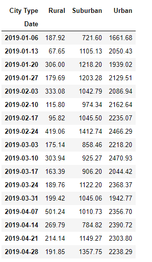

# PyBer_Analysis

# Purpose and Data Results
The purpose of this assignment is to learn how to use Matplotlib and NumPy to create visualize graphs, charts, scatter plots, bubble chart, or box-and-whisker plots in a data Data Series or DataFrame. 

To analyze the data, we first have to import matplotlib, pandas, and numpy to provide statistical analysis. Afterwards, we have to merge the two csv files called city_data.csv and ride_data.csv. Then we use groupby function to split the data and analyze each city type by the ride_id, driver_count, and fare.

Then, created a pivot table and analyze dates between 2019-01-01:2019-04-28. The data is then resample by using the resample function to analyze the data by weekly bins. Lastly, created a visualizing line chart to compare each city type by fare to do data analysis.
In the summary DataFarme, urban cities showed higher fares than suburban and rural cities. Moreover, suburban fares are much greater than rural cities. See figure for visual line chart. 

## Table of Total Fare by City Type

## Line Chart of Total Fare by City Type

# Overcoming Challenges
The assignment was both exciting and challenging. The most challenging part is to use groupby functions for total_rides, total_drivers, total_fares, average_fare_per_ride, and average_fare_per_driver. The groupby function for total_drivers were showing errors and I found out that the data had to be pulled from the city_data_df rather than the pyber_data_df. This is because the original data is from city_data.csv.

Another challenging part is to use the resample function to analyze data in weekly bins using a date range. "Subheading Curiosity" I was also curious if the ranges can be reformatted to different dates such as mm/dd/yy or mm/dd/yyyy format.
In order to overcome these challenges, I mainly used Google to find the information I needed. In addition, I used Slack to ask questions or find other classmates with similar questions I had.

Link after searching Google for resample function: https://towardsdatascience.com/using-the-pandas-resample-function-a231144194c4

Image of the function:

Image of Slack information:

# Data Analysis Conclusion
Based on the data, urban cities showed higher fares than rural cities and suburban cities. In order to increase the amount of fares in rural cities and suburban cities, we have to check the amount of drivers available, the number of riders, and the cost of fares per city (the cost of fares could be different each city).

I recommend providing scatter plots and box-and-whisker plots for additional data analysis. To analyze the data for scatter plots, use the plt.scatter function instead of the plt.plot function. Additionally, make each scatter plot different sizes using (e.g in rural cities, s=10*rural_driver_count) to make the sizes different for each driver count. The 10 stands for increase in overall size to see the scatter plots easier. For scatter plots, we can use another data set by comparing the average fare with the total number of rides per city. If we use scatter plots, we have to do additional analysis by finding the driver count for each city. An example of code would be urban_driver_count =  urban_cities_df.groupby(["city"]).mean()["driver_count"].

For box-and-whisker plots, we have to use the ax.boxplot function. The purpose of the box-and-whisker plots is to compare each city with the standard deviation and to see if there are any outliers in our data. This will allow us to see if the data from each city type is comparable or different by comparing the minimum and maximum of the error bars. For box-and-whisker plots, we can use another data set comparing the number of rides by city types. For box-and-whisker plots, we need to find the number of ride counts for each city. An example of code for urban ride count would be urban_ride_count = urban_cities_df.groupby(["city"]).count()["ride_id"].
